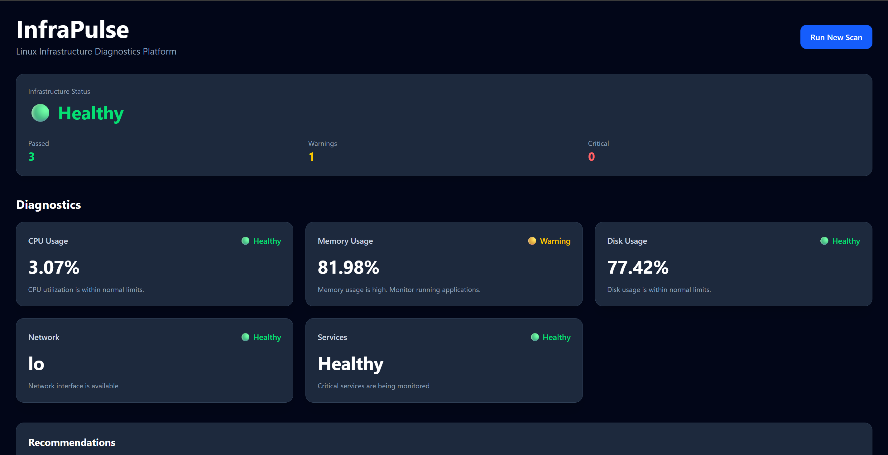
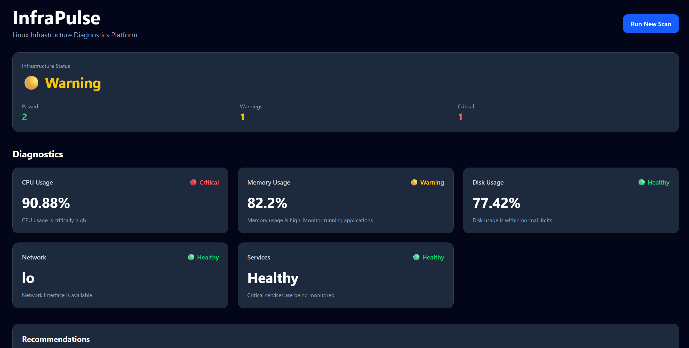
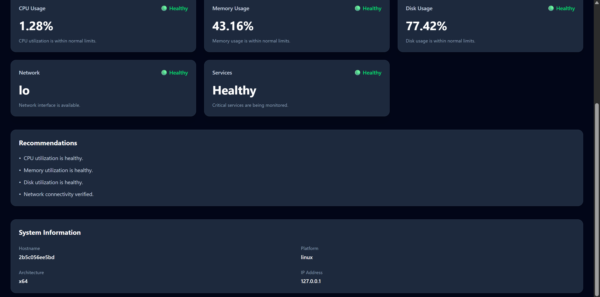

# InfraPulse

## Linux Infrastructure Monitoring & Diagnostics Platform

InfraPulse is a cloud-deployed Linux infrastructure monitoring platform that collects real-time system metrics, evaluates infrastructure health, and provides intelligent diagnostics through an interactive dashboard.

The platform is designed with Site Reliability Engineering (SRE) concepts in mind and demonstrates Linux system monitoring, cloud deployment, Docker containerization, reverse proxy configuration, and infrastructure health analysis.

---

## Features

- Real-time Linux infrastructure monitoring
- CPU utilization monitoring
- Memory utilization monitoring
- Disk usage monitoring
- Network interface monitoring
- Service health monitoring
- Infrastructure health scoring engine
- Intelligent recommendations based on system thresholds
- One-click infrastructure scan
- Responsive monitoring dashboard
- Dockerized backend deployment
- AWS EC2 deployment
- Nginx reverse proxy configuration

---

## Architecture

```
                Browser
                     │
                     ▼
          React Dashboard (Vite)
                     │
                HTTP Requests
                     │
                     ▼
          Nginx Reverse Proxy
                     │
                     ▼
      Dockerized Node.js Backend
                     │
                     ▼
      Linux Diagnostics Engine
                     │
                     ▼
      systeminformation + Linux OS
```

---

## Tech Stack

### Frontend

- React
- Vite
- Tailwind CSS

### Backend

- Node.js
- Express.js
- systeminformation
- REST APIs

### DevOps / Infrastructure

- Ubuntu Linux
- Docker
- Nginx
- AWS EC2
- Git
- GitHub

---

## Health Monitoring

InfraPulse continuously evaluates:

- CPU Usage
- Memory Usage
- Disk Usage
- Network Status
- Critical Services

Each component is evaluated against predefined thresholds.

Example:

| Component | Healthy | Warning | Critical |
|-----------|----------|----------|----------|
| CPU | <70% | 70–85% | >85% |
| Memory | <75% | 75–90% | >90% |
| Disk | <80% | 80–90% | >90% |

---

## Infrastructure Health Score

The diagnostics engine assigns weighted scores to each monitored component.

Example:

```
CPU        → 25 points
Memory     → 25 points
Disk       → 25 points
Network    → 25 points
```

Overall system health is calculated based on these scores and displayed as:

- Healthy
- Warning
- Critical

---

## Recommendations Engine

InfraPulse automatically generates infrastructure recommendations such as:

- High CPU utilization detected
- Memory usage is above threshold
- Disk cleanup recommended
- Network connectivity verified

---

## Deployment

The application is deployed on:

- Ubuntu EC2 Instance
- Docker Container
- Nginx Reverse Proxy

Deployment workflow:

```
GitHub
    │
    ▼
Ubuntu EC2
    │
Git Clone
    │
Docker Build
    │
Docker Container
    │
Nginx Reverse Proxy
    │
Public Dashboard
```

##Screenshots




---

## Learning Outcomes

Through this project I gained practical experience with:

- Linux system administration
- Infrastructure monitoring
- Docker containerization
- Cloud deployment on AWS EC2
- Reverse proxy configuration using Nginx
- REST API development
- Infrastructure health evaluation
- Production deployment workflow
- Troubleshooting Linux deployment issues

---

## Author

**Samyak Kamble**
